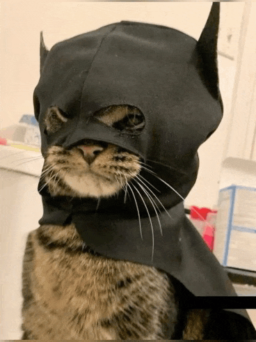
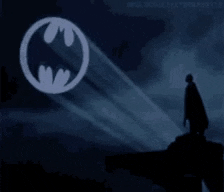

  
  
  <h2 style="color: #FFD700;">🦇 I'm Ömer Ata Bebek</h2>
  <h3>The Dark Knight of Code 🌑</h3>
  
  

    <b>Computer Engineering Student at Kadir Has University.</b> 
     
    <i>"It's not who I am underneath, but what I code that defines me."</i>
  

  
   

  
  &nbsp;
  

    

  

    

  
   &nbsp; 
  

    
  

   

  
<i>"I go from Tuzla to Kadir Has, my road is very long, I really need a Batmobile."</i> 🏎️💨

  
  

